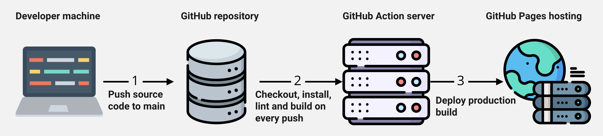

# goit-react-hw-05-movies

## Кінопошук

Створи базову маршрутизацію для застосунку пошуку і зберігання фільмів. Прев'ю робочого застосунку [дивись за посиланням](https://drive.google.com/file/d/1vR0hi3n1236Q5Bg4-se-8JVKD9UKSfId/view).

### themoviedb.org API

Для бекенду використовуй [themoviedb.org API](https://www.themoviedb.org/). Необхідно зареєструватися (можна ввести довільні дані) та отримати API-ключ. У цій роботі будуть використовуватися наступні ендпоінти.

[/trending/get-trending](https://developer.themoviedb.org/reference/trending-all) список найпопулярніших фільмів на сьогодні для створення колекції на головній сторінці.
[/search/search-movies](https://developer.themoviedb.org/reference/search-movie) пошук фільму за ключовим словом на сторінці фільмів.
[/movies/get-movie-details](https://developer.themoviedb.org/reference/movie-details) запит повної інформації про фільм для сторінки кінофільму.
[/movies/get-movie-credits](https://developer.themoviedb.org/reference/movie-credits) запит інформації про акторський склад для сторінки кінофільму.
[/movies/get-movie-reviews](https://developer.themoviedb.org/reference/movie-reviews) запит оглядів для сторінки кінофільму.

### Маршрути

У застосунку повинні бути такі маршрути. Якщо користувач зайшов за неіснуючим маршрутом, його необхідно перенаправляти на домашню сторінку.

'/' – компонент Home, домашня сторінка зі списком популярних кінофільмів.
'/movies' – компонент Movies, сторінка пошуку кінофільмів за ключовим словом.
'/movies/:movieId' – компонент MovieDetails, сторінка з детальною інформацією про кінофільм.
/movies/:movieId/cast – компонент Cast, інформація про акторський склад. Рендериться на сторінці MovieDetails.
/movies/:movieId/reviews – компонент Reviews, інформація про огляди. Рендериться на сторінці MovieDetails.

### Code Splitting (поділ коду)

Додай асинхронне завантаження JS-коду для маршрутів застосунку, використовуючи React.lazy() і Suspense.

# React homework template

Этот проект был создан при помощи
[Create React App](https://github.com/facebook/create-react-app). Для знакомства
и настройки дополнительных возможностей
[обратись к документации](https://facebook.github.io/create-react-app/docs/getting-started).

## Создание репозитория по шаблону

Используй этот репозиторий организации GoIT как шаблон для создания репозитория
своего проекта. Для этого нажми на кнопку `«Use this template»` и выбери опцию
`«Create a new repository»`, как показано на изображении.


На следующем шаге откроется страница создания нового репозитория. Заполни поле
его имени, убедись что репозиторий публичный, после чего нажми кнопку
`«Create repository from template»`.


После того как репозиторий будет создан, необходимо перейти в настройки
созданного репозитория на вкладку `Settings` > `Actions` > `General` как
показано на изображении.


Проскролив страницу до самого конца, в секции `«Workflow permissions»` выбери
опцию `«Read and write permissions»` и поставь галочку в чекбоксе. Это
необходимо для автоматизации процесса деплоя проекта.


Теперь у тебя есть личный репозиторий проекта, со структурой файлов и папок
репозитория-шаблона. Далее работай с ним как с любым другим личным репозиторием,
клонируй его себе на компьютер, пиши код, делай коммиты и отправляй их на
GitHub.

## Подготовка к работе

1. Убедись что на компьютере установлена LTS-версия Node.js.
   [Скачай и установи](https://nodejs.org/en/) её если необходимо.
2. Установи базовые зависимости проекта командой `npm install`.
3. Запусти режим разработки, выполнив команду `npm start`.
4. Перейди в браузере по адресу [http://localhost:3000](http://localhost:3000).
   Эта страница будет автоматически перезагружаться после сохранения изменений в
   файлах проекта.

## Деплой

Продакшн версия проекта будет автоматически проходить линтинг, собираться и
деплоиться на GitHub Pages, в ветку `gh-pages`, каждый раз когда обновляется
ветка `main`. Например, после прямого пуша или принятого пул-реквеста. Для этого
необходимо в файле `package.json` отредактировать поле `homepage`, заменив
`your_username` и `your_repo_name` на свои, и отправить изменения на GitHub.

```json
"homepage": "https://your_username.github.io/your_repo_name/"
```

Далее необходимо зайти в настройки GitHub-репозитория (`Settings` > `Pages`) и
выставить раздачу продакшн версии файлов из папки `/root` ветки `gh-pages`, если
это небыло сделано автоматически.


### Статус деплоя

Статус деплоя крайнего коммита отображается иконкой возле его идентификатора.

- **Желтый цвет** - выполняется сборка и деплой проекта.
- **Зеленый цвет** - деплой завершился успешно.
- **Красный цвет** - во время линтинга, сборки или деплоя произошла ошибка.

Более детальную информацию о статусе можно посмотреть кликнув по иконке, и в
выпадающем окне перейти по ссылке `Details`.


### Живая страница

Через какое-то время, обычно пару минут, живую страницу можно будет посмотреть
по адресу указанному в отредактированном свойстве `homepage`. Например, вот
ссылка на живую версию для этого репозитория
[https://goitacademy.github.io/react-homework-template](https://goitacademy.github.io/react-homework-template).

Если открывается пустая страница, убедись что во вкладке `Console` нет ошибок
связанных с неправильными путями к CSS и JS файлам проекта (**404**). Скорее
всего у тебя неправильное значение свойства `homepage` в файле `package.json`.

### Маршрутизация

Если приложение использует библиотеку `react-router-dom` для маршрутизации,
необходимо дополнительно настроить компонент `<BrowserRouter>`, передав в пропе
`basename` точное название твоего репозитория. Слеш в начале строки обязателен.

```jsx
<BrowserRouter basename="/your_repo_name">
  <App />
</BrowserRouter>
```

## Как это работает



1. После каждого пуша в ветку `main` GitHub-репозитория, запускается специальный
   скрипт (GitHub Action) из файла `.github/workflows/deploy.yml`.
2. Все файлы репозитория копируются на сервер, где проект инициализируется и
   проходит линтинг и сборку перед деплоем.
3. Если все шаги прошли успешно, собранная продакшн версия файлов проекта
   отправляется в ветку `gh-pages`. В противном случае, в логе выполнения
   скрипта будет указано в чем проблема.
